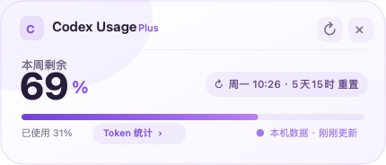
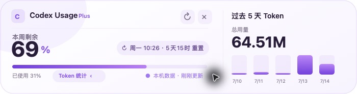

# Codex Usage Float

一个轻量、原生的 macOS Codex 用量悬浮窗。无需 API Key，直接读取本机 Codex 会话日志，展示每周剩余额度和最近 5 天 Token 使用趋势。



点击卡片中的 **Token 统计**，即可展开过去 5 天的总用量与每日趋势；鼠标悬停在柱形上可查看当天 Token 数值。



## 功能

- 自动读取 Codex 每周用量、剩余百分比与重置时间
- 最近 5 个自然日 Token 总量与每日趋势
- Token 数值悬停显示，默认保持界面简洁
- 每 45 秒自动刷新，也支持手动刷新
- 原生 macOS 悬浮面板，始终置顶、可拖动、跨桌面显示
- 右下角拖拽手柄支持等比例缩放，紧凑与统计视图均不会错位
- 菜单栏常驻入口，可显示、隐藏、刷新或退出
- 支持 Codex Desktop 启动时自动显示
- 紫白主题，与 Codex Desktop 视觉风格协调
- 不依赖第三方运行库，不上传任何本地数据

## 系统要求

- macOS 13 或更高版本
- 已安装 Xcode Command Line Tools
- 已使用 Codex Desktop 或 Codex CLI，并在 `~/.codex` 中产生会话日志

## 构建

```bash
git clone https://github.com/xiaoxima1214/codex-usage-float.git
cd codex-usage-float
chmod +x build.sh
./build.sh
open "dist/Codex Usage.app"
```

构建产物位于 `dist/Codex Usage.app`。应用使用本地临时签名，不需要 Apple Developer 账号。

## Codex 启动时自动显示

运行安装脚本：

```bash
chmod +x install-autostart.sh uninstall-autostart.sh
./install-autostart.sh
```

脚本会重新构建应用，将其安装到 `~/Applications/Codex Usage.app`，并注册一个轻量的用户级 LaunchAgent。监视器在后台等待 Codex Desktop；检测到 Codex 从未运行变为已运行时，自动显示浮窗。浮窗被隐藏后，再次启动 Codex 也会重新显示。整个过程不需要管理员权限。

如需关闭自动显示：

```bash
./uninstall-autostart.sh
```

卸载脚本只移除自动启动配置，不会删除应用或 Codex 数据。

## 使用

1. 启动应用后，悬浮窗会出现在屏幕右上角。
2. 点击 `Token 统计` 展开或收起最近 5 天统计。
3. 将鼠标移到柱状图上查看当天 Token 用量。
4. 点击右上角 `×` 只会隐藏悬浮窗。
5. 点击菜单栏仪表图标可重新显示窗口或彻底退出。
6. 拖动卡片右下角的紫色手柄可调整浮窗大小。

## 数据口径

- **每周用量**：读取最新 Codex 会话日志中 `window_minutes = 10080` 的限额数据，以适配限额字段结构变化。
- **Token 用量**：按每个会话的累计 Token 增量计算，再根据系统本地时区归入最近 5 个自然日。
- **Token 范围**：使用日志中的 `total_tokens`，包含输入与输出 Token，也包含 Codex 记录在总量中的缓存输入 Token。

## 隐私

应用只在本机读取以下目录：

```text
~/.codex/sessions
~/.codex/archived_sessions
```

不会发起网络请求，不会上传、修改或删除任何 Codex 数据。

## 项目结构

```text
CodexUsageFloat.m  # AppKit 界面、日志解析与统计
Info.plist         # macOS 应用配置
build.sh           # 构建、签名和打包脚本
install-autostart.sh   # 安装应用并启用登录自启
watch-codex.sh          # 检测 Codex Desktop 启动
uninstall-autostart.sh # 关闭自动显示
assets/            # README 展示图片
```

## License

[MIT](LICENSE)
